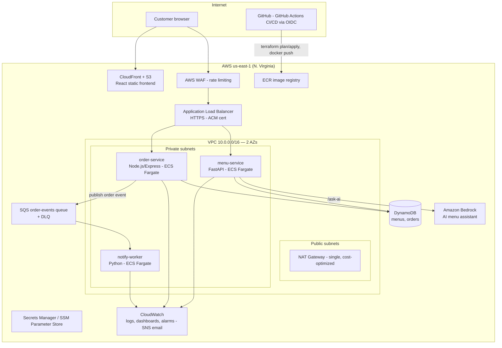

# Handoff: Portfolio Project + Skill Roadmap for Cloud / DevOps / AWS Solutions Architect Roles in Malaysia

> **Audience of this document:** A Claude agent (or human) tasked with building a recruiter-attractive
> portfolio project, and the candidate following the skill roadmap.
> **Candidate goal:** Land a Cloud Engineer / DevOps Engineer / Associate Solutions Architect role in
> Malaysia — with the **Amazon "Associate Solutions Architect, AWS Malaysia" role (Job ID 10441656)**
> as the primary target.
> **Research date:** 2026-07-07. Sources at the bottom.

---

## Part 1 — Market Research: What Employers in Malaysia Actually Ask For

### 1.1 Primary target: Associate Solutions Architect, AWS Malaysia (Amazon.jobs, Job ID 10441656)

Location: Kuala Lumpur, Amazon Web Services Malaysia SDN. BHD. Early-career role.

**Responsibilities (from the posting):**
- Design and build cloud solutions across **migrations, modernization, and new workloads**
- Build **"prototypes, proofs of concept, and demos, often at short notice, to help customers visualize and validate solutions"**
- Assess customer applications and databases and propose **modernization strategies**
- Support **cloud migration execution** — moving workloads securely and efficiently
- **Experiment with AI and emerging technologies** and build working examples for customer problems
- Work with account teams to identify value opportunities; adapt quickly across multiple customers
- Contribute to knowledge-sharing: **content creation, demos, collaboration**
- Team culture explicitly stated: *"You don't just read about new technologies, you build with them."*

**Basic qualifications (verbatim themes):**
- Programming experience with **Python, Ruby, Node.js, C#, or C++**
- Experience in at least **two** of: **networking fundamentals, security, storage or databases (relational or NoSQL), operating systems (Unix/Linux/Windows)**
- **2+ years of IT experience**
- **Bachelor's degree**

**Preferred qualifications:**
- Cloud-based technology **solution implementation** experience
- Background in **Cloud Architecture, Systems Design, Software Development, Infrastructure Architecture, Data Engineering, or DevOps**

**Implication:** This role is won by demonstrating *builder* evidence (prototypes, demos, PoCs), breadth
across 2+ technical domains, communication ability (content, demos), and curiosity about GenAI. The
portfolio project below is engineered to produce exactly that evidence.

### 1.2 DevOps Engineer roles (JobStreet / Indeed / Glassdoor Malaysia — recurring requirements)

Aggregated from hundreds of active listings (KL, Petaling Jaya, Cyberjaya, Penang/Bayan Lepas, Putrajaya):

| Category | What postings repeatedly demand |
|---|---|
| Cloud | **AWS first**, then Azure/GCP; multi-cloud exposure a plus |
| IaC | **Terraform** (most common), CloudFormation, AWS CDK, Ansible |
| Containers | **Docker + Kubernetes** (EKS/ECS); Helm; some ask CKA cert |
| CI/CD | **Jenkins, GitHub Actions, GitLab CI**; quality gates (SonarQube) |
| Observability | **Prometheus, Grafana**, Datadog, ELK, CloudWatch |
| Scripting | **Python and Bash** (Ruby occasionally) |
| OS / Networking | Linux administration, VPC/network concepts, DNS, TLS |
| Security / DevSecOps | Growing hard requirement: security scanning in pipelines, secrets management, compliance |
| Experience | Entry: fresh grad – 2 yrs (Linux, Git, scripting, CI/CD concepts). Mid: 2–5 yrs production experience with cloud + K8s + Terraform + monitoring |
| Certifications | **AWS SAA-C03 leads job-posting volume**; also AWS DevOps Engineer Pro, CKA, Terraform Associate. Certs raise salary ~15–25% |

### 1.3 Cloud Engineer roles (Indeed/Glassdoor KL — recurring requirements)

- Design, deploy, maintain cloud environments on **AWS (preferred)**, Azure, or GCP
- IaC with **Terraform / CDK / CloudFormation**; containers on **ECS and EKS**
- Implement **CI/CD pipelines**; integrate cloud services with DevOps workflows
- Manage **networking, storage, compute, identity (IAM)**; enforce **security controls & compliance**
- Monitor **performance, availability, security**
- Typical bar: degree in CS/Engineering + ~3 yrs experience for mid roles; junior/fresh-grad roles exist and emphasize logical thinking + fundamentals

### 1.4 Salary reality check (Malaysia, 2026)

- DevOps median ≈ **RM9,000/month**; overall range RM4,650–RM16,500/month
- Entry/junior (1–3 yrs): ~RM56k–100k/year depending on source and company tier
- Senior (8+ yrs): ~RM160k+/year; MNCs/fintech pay top of band
- AWS certification measurably lifts offers (15–25%)

### 1.5 The gap this project must close

Recruiters in this market see hundreds of CVs listing "AWS, Docker, Kubernetes, Terraform" with zero
proof. What is rare and gets interviews:

1. A **public GitHub repo** that looks like a real production system, not a tutorial clone
2. **Architecture documentation and diagrams** that show *design thinking* (SA signal)
3. **CI/CD you can watch run** (green Actions history, PR discipline)
4. **Security & cost awareness** baked in (DevSecOps + FinOps signals — differentiators in Malaysia)
5. A **GenAI/Bedrock feature** (directly echoes the Amazon posting's "experiment with AI")
6. **Written/video content** explaining it (SA roles are communication roles)

---

## Part 2 — THE PROJECT: "MakanLah" — Production-Grade Cloud-Native Food-Ordering Platform on AWS

### 2.1 Instructions to the building agent

You are building a portfolio project for a candidate targeting Cloud/DevOps/Associate SA roles in
Malaysia. Treat this document as the spec. Rules of engagement:

- **Everything as code.** No console-clicking except account bootstrap. If it isn't in the repo, it doesn't exist.
- **Build in the phase order below.** Each phase has acceptance criteria; do not proceed until met.
- **Cost discipline is a feature.** Respect the cost guardrails in §2.8. Anything expensive (EKS) is *ephemeral*: spin up, capture evidence (screenshots/recordings), tear down.
- **Document as you go.** Every phase ends with README/docs updates. The repo's docs are half the deliverable.
- **Commit hygiene matters.** Conventional commits, feature branches, PRs with descriptions — recruiters read the history.
- The candidate must be able to explain every line. Prefer clear, idiomatic, boring solutions over clever ones, and keep explanatory design notes in `docs/decisions/` (ADRs).

### 2.2 Elevator pitch (goes at the top of the README)

> **MakanLah** is a cloud-native food-ordering platform for Malaysian hawker stalls, built and operated
> like a production system: microservices on AWS ECS Fargate (with an EKS/Kubernetes deployment
> track), 100% Terraform-managed infrastructure, GitHub Actions CI/CD with OIDC (zero stored cloud
> credentials), full observability, DevSecOps scanning gates, and an Amazon Bedrock-powered AI menu
> assistant. Designed for high availability, least-privilege security, and a <$15/month steady-state
> AWS bill.

Why this business domain: instantly relatable to Malaysian recruiters, naturally justifies
microservices (orders, menus, notifications), async processing (order queue), and an AI feature
(menu Q&A / halal-dietary assistant). It gives interview stories, not just tech.

### 2.3 Goals / Non-goals

**Goals**
- Prove: AWS core services, Terraform, Docker, Kubernetes, CI/CD, observability, security, GenAI, cost control
- Produce: green pipelines, dashboards, diagrams, ADRs, a demo video, and 5–6 strong resume bullets
- Cover the Amazon Associate SA basic quals: Python/Node programming ✔, networking ✔, security ✔, databases ✔, Linux ✔

**Non-goals**
- Real payments, real users, mobile apps, multi-region active-active (mention as "future work" in docs)
- Feature completeness of the app itself — the app is a *vehicle*; infra/operations excellence is the product

### 2.4 Architecture



**Component summary**

| Component | Technology | Why (interview justification) |
|---|---|---|
| Frontend | React + Vite, S3 + CloudFront | Static hosting pattern, CDN, OAC, cheap |
| menu-service | **Python FastAPI** | Menu CRUD + `/ask-ai` Bedrock endpoint; Python = Amazon basic qual |
| order-service | **Node.js Express/Fastify** | Order placement; second language = breadth signal |
| notify-worker | Python, SQS consumer | Async/event-driven pattern, decoupling story, DLQ handling |
| Data | DynamoDB (on-demand) | NoSQL qual box, single-digit-ms reads, free-tier friendly |
| Runtime (primary) | **ECS Fargate** | Serverless containers, always-on cheaply |
| Runtime (track 2) | **EKS + Helm** (ephemeral) | Kubernetes keyword, HPA, Prometheus/Grafana |
| IaC | **Terraform** ≥1.9, modules, S3 remote state + lockfile | The #1 IaC demand in MY postings |
| CI/CD | **GitHub Actions + AWS OIDC** | Zero stored secrets — strong security talking point |
| Observability | CloudWatch (ECS track), **Prometheus + Grafana** (EKS track) | Both aggregator-demanded stacks |
| Security | tfsec/Checkov, Trivy, gitleaks, least-priv IAM, Secrets Manager, WAF | DevSecOps differentiator |
| GenAI | **Amazon Bedrock** (Claude model) | Mirrors Amazon posting's AI experimentation |
| Load testing | k6 | Produces autoscaling evidence |

**Key design decisions to record as ADRs (docs/decisions/):**
1. ECS Fargate primary vs EKS-only — cost vs keyword coverage (run both, EKS ephemeral)
2. DynamoDB vs RDS — access patterns, cost, and where RDS *would* win (shows judgment)
3. Single NAT Gateway vs one per AZ — cost/availability trade-off, quantified
4. GitHub OIDC federation vs IAM user keys — security posture
5. SQS between order-service and worker — failure isolation, retries, DLQ
6. Region selection: `us-east-1` vs `ap-southeast-5` (Malaysia) — **decided us-east-1** (2026-07-08): lowest pricing, fullest service and Bedrock model availability, most reference material; ADR documents the Malaysia-latency trade-off and what a region migration would involve

### 2.5 Repository layout (single public monorepo: `makanlah-platform`)

```
makanlah-platform/
├── README.md                      # pitch, architecture diagram, screenshots, quickstart, cost table
├── docs/
│   ├── architecture.md            # full diagram set + component walkthrough
│   ├── decisions/ADR-001..006.md
│   ├── runbook.md                 # deploy, rollback, incident response, teardown
│   ├── cost.md                    # monthly cost breakdown + optimizations applied
│   └── demo/                      # screenshots, GIFs, link to demo video
├── services/
│   ├── menu-service/              # FastAPI + tests + Dockerfile (multi-stage, non-root, distroless/slim)
│   ├── order-service/             # Node.js + tests + Dockerfile
│   └── notify-worker/             # Python SQS consumer + tests + Dockerfile
├── frontend/                      # React + Vite
├── infra/
│   ├── bootstrap/                 # state bucket + lock, OIDC provider + CI roles (applied once)
│   ├── modules/
│   │   ├── network/  ecs-service/  alb/  dynamodb/  sqs/  observability/  frontend/  eks/
│   └── envs/
│       ├── dev/                   # small sizes, scale-to-zero where possible
│       └── prod/                  # 2-AZ, autoscaling, alarms
├── deploy/
│   ├── helm/makanlah/             # chart for EKS track (deployments, HPA, ingress, servicemonitors)
│   └── k8s-local/                 # kind/minikube manifests for free local K8s dev
├── .github/workflows/
│   ├── ci.yml                     # per-service: lint, unit tests, build, Trivy scan, push to ECR
│   ├── infra-plan.yml             # PR: fmt/validate/tflint/tfsec/Checkov + terraform plan as PR comment
│   ├── infra-apply.yml            # main: apply dev; tag v* + manual approval (environment): apply prod
│   ├── deploy.yml                 # ECS service update w/ health-gated rollout; rollback on alarm
│   └── security.yml               # scheduled gitleaks + dependency audit + image rescan
├── load/k6/                       # load test scripts + results
├── scripts/                       # teardown.sh, cost-report.sh, seed-data.py
└── Makefile                       # make up-local / test / plan / deploy-dev / demo-eks / nuke
```

### 2.6 Build phases, steps, and acceptance criteria

**Phase 0 — Foundations (repo + AWS account safety)**
1. Create AWS account (or clean sub-account via Organizations); enable MFA on root; create admin IAM Identity Center user.
2. **First action: AWS Budget at $5/month with email alerts at 50/80/100%** + billing alarms. (Candidate decision 2026-07-08: $5 hard cap — always-on dev infra is out; environments run only during active work/demo sessions and are destroyed after, `make nuke` discipline from day one.)
3. Create public GitHub repo `makanlah-platform`; branch protection on `main` (PRs required, CI must pass).
4. `infra/bootstrap`: Terraform state S3 bucket (versioned, encrypted, TLS-only policy) and GitHub OIDC provider + two IAM roles (`ci-readonly-plan`, `ci-deploy`) with scoped trust to this repo/branch.
- ✅ *Accept:* budget alarm fires on test; `terraform init` against remote state works; a hello-world workflow assumes the OIDC role successfully (no access keys anywhere).

**Phase 1 — Services (the app)**
1. `menu-service` (FastAPI): CRUD for stalls/menus; `GET /healthz`, `GET /readyz`; structured JSON logs; pytest ≥80% on handlers.
2. `order-service` (Node): create/get orders; publishes `OrderPlaced` to SQS; idempotency key on POST; jest tests.
3. `notify-worker` (Python): consumes SQS, simulates notification, handles poison messages → DLQ after 3 receives.
4. Dockerfiles: multi-stage, pinned base images, non-root user, HEALTHCHECK; images <200MB.
5. `docker compose up` runs everything locally with DynamoDB Local + LocalStack (or ElasticMQ) for SQS.
- ✅ *Accept:* `make up-local && make test` green; an order placed via curl flows end-to-end locally; README has an animated GIF of this.

**Phase 2 — Core infrastructure (Terraform)**
1. `network` module: VPC, 2 public + 2 private subnets across 2 AZs, single NAT, VPC endpoints for ECR/S3/CloudWatch/DynamoDB (cuts NAT cost — document the numbers).
2. `dynamodb`, `sqs` (+DLQ), `ecr` (with lifecycle policies + scan-on-push).
3. `alb` module: HTTPS listener (ACM; use a cheap domain via Route53, or self-note the HTTP fallback), target groups, WAF rate-limit rule.
4. `ecs-service` module: reusable — task def, service, autoscaling policies, least-privilege task role per service (menu can't touch orders table, etc.), Secrets from SSM.
5. Wire `envs/dev`: all three services running on Fargate behind ALB.
- ✅ *Accept:* fresh `terraform apply` from zero brings the whole environment up in <20 min; `curl https://.../api/menus` works from the internet; tfsec + Checkov report zero HIGH findings (documented suppressions allowed).

**Phase 3 — CI/CD (the showpiece)**
1. `ci.yml`: on PR touching a service — lint, unit tests, build, **Trivy image scan (fail on HIGH/CRITICAL)**, push `sha`-tagged image to ECR (via OIDC).
2. `infra-plan.yml`: on PR touching infra — fmt/validate/tflint/tfsec/Checkov, `terraform plan` posted as a PR comment.
3. `infra-apply.yml`: merge to main → auto-apply **dev**; git tag `v*` → **prod** behind a GitHub Environment with required reviewer (manual approval gate).
4. `deploy.yml`: ECS rolling deploy gated on health checks; **auto-rollback** if the CloudWatch 5xx alarm trips within 10 min post-deploy.
5. `security.yml`: weekly gitleaks, `npm audit`/`pip-audit`, rescan of latest images.
6. Add status badges to README.
- ✅ *Accept:* a one-line code change goes PR → review → merge → live in dev with zero manual steps; a deliberately-broken deploy demonstrably auto-rolls back (record it for docs/demo/).

**Phase 4 — Observability & resilience evidence**
1. CloudWatch: log groups w/ retention, dashboard (p95 latency, 5xx rate, SQS depth & age, task counts), alarms → SNS email: ALB 5xx, p95 > 800ms, DLQ > 0, task crash-looping.
2. Distributed tracing: AWS X-Ray (or ADOT) on both APIs — trace an order across service → SQS → worker.
3. k6 load test: ramp to ~200 VUs; capture ECS autoscaling from 1→N tasks; store results + screenshots in `load/` and `docs/demo/`.
4. Chaos drill: kill tasks mid-load, document recovery behavior in `runbook.md`.
- ✅ *Accept:* dashboard screenshot shows autoscale event under load with p95 within SLO; runbook documents one simulated incident end-to-end.

**Phase 5 — Kubernetes track (ephemeral EKS)**
1. `deploy/k8s-local`: run all services on **kind** with local manifests first (free Kubernetes practice).
2. Helm chart `makanlah`: deployments (probes, resource requests/limits), HPA, AWS Load Balancer Controller ingress, ExternalSecrets or SSM CSI.
3. `infra/modules/eks`: EKS with managed node group (2× t3.small SPOT) — designed to live **hours, not days**.
4. Install kube-prometheus-stack; Grafana dashboard for the services; re-run k6, watch **HPA scale pods**.
5. Capture generously: screenshots, terminal recordings (asciinema), Grafana panels → `docs/demo/`. Then **`terraform destroy`**.
6. Optional stretch: Argo CD app-of-apps for GitOps (only if time permits; document even if not built).
- ✅ *Accept:* documented evidence of the full platform on EKS incl. HPA scaling under load; EKS destroyed; `docs/` explains how anyone can re-run the demo with 3 commands (`make demo-eks`, `make demo-load`, `make nuke`).

**Phase 6 — GenAI feature (Amazon Bedrock)**
1. `POST /ask-ai` on menu-service: customer asks natural-language questions ("What's spicy and under RM10?", "Which dishes are halal-friendly?"); service pulls the stall's menu from DynamoDB, builds a prompt, calls **Bedrock (Claude)**, returns a grounded answer. Guardrails: answer only from menu data, refuse otherwise.
2. IAM: task role allows `bedrock:InvokeModel` on the one model ARN only.
3. Frontend: simple chat box on the stall page.
4. Cost control: per-IP daily cap, response caching for repeated questions, max-token limits.
5. `docs/`: prompt design write-up + a paragraph on where RAG/Knowledge Bases would take this next (SA-interview gold).
- ✅ *Accept:* live demo answers menu questions grounded in real data and declines off-menu questions; total Bedrock spend for the build <$5.

**Phase 7 — Packaging for recruiters (do not skip — this phase gets the interviews)**
1. README final pass: pitch → architecture diagram → 3 GIFs (local dev, pipeline run, AI assistant) → badges → cost table → quickstart.
2. `docs/architecture.md`: full narrative walkthrough as if presenting to a customer (SA-style), including a "how I'd evolve this to 100k users" section (read replicas/DAX, multi-region, ECS→EKS migration path, cellular architecture).
3. Record a **5–7 min demo video** (Loom/YouTube unlisted): architecture in 60s, then live order flow, pipeline run, dashboard under load, AI assistant. Link it top of README.
4. Write 2–3 posts (LinkedIn or dev.to): "Cutting my AWS bill 60% with VPC endpoints", "Zero-credential CI/CD with GitHub OIDC", "Adding a Bedrock AI assistant to a FastAPI service". Content creation is *explicitly* in the Amazon job description.
5. Extract resume bullets (see §2.9). Update LinkedIn headline/About/Projects with keyword-aligned phrasing.
- ✅ *Accept:* a stranger can understand the entire system in 3 minutes from the README alone; video link works in incognito.

### 2.7 What "recruiter-attractive" means — checklist the repo must satisfy

- [ ] Public repo, meaningful name, description, and topics (`aws`, `terraform`, `kubernetes`, `devops`, `ci-cd`, `bedrock`)
- [ ] 100+ commits over weeks (real history), PRs with descriptions, no `fix typo x8` spam on main
- [ ] Green CI badges; visible Actions history
- [ ] Architecture diagram within the first screenful of the README
- [ ] Screenshots/GIFs — recruiters don't run code
- [ ] Cost table (screams production judgment)
- [ ] Security section: OIDC, least-privilege IAM, scanners, secrets handling
- [ ] ADRs — screams architect thinking
- [ ] Demo video link
- [ ] No secrets ever committed (gitleaks in CI from day 1)

### 2.8 Cost guardrails

| Item | Steady-state monthly | Control |
|---|---|---|
| ECS Fargate (3× 0.25 vCPU/0.5GB, dev) | ~$8–12 | Scale dev to zero overnight via scheduled scaling; or run only when demoing |
| ALB | ~$18 if always-on | **Biggest lever:** keep dev ALB up only during active weeks; destroy env when idle (`make nuke`) |
| NAT Gateway | ~$3–5 w/ endpoints | Single NAT + VPC endpoints; document savings |
| DynamoDB / SQS / ECR / CloudWatch | ~$1–3 | On-demand, retention policies, lifecycle rules |
| EKS track | ~$0.10/hr control plane + spot nodes | **Ephemeral only** — hours per demo session, then destroy |
| Bedrock | <$5 total | Token caps, caching, rate limit |
| Route53 + domain | ~$1/mo + ~$5–12/yr | Optional but recommended for HTTPS demo |

Absolute rule: **budget alarm before first apply; `make nuke` must reliably destroy everything.**

### 2.9 Resume bullets this project generates (adapt truthfully)

- Designed and operated a production-grade microservices platform on AWS (ECS Fargate, ALB, DynamoDB, SQS, CloudFront) across 2 AZs, fully provisioned with Terraform modules and remote state
- Built zero-credential CI/CD with GitHub Actions + AWS OIDC: automated tests, Trivy/tfsec/Checkov security gates, plan-on-PR, environment promotion with manual prod approval, and alarm-driven automatic rollback
- Deployed the same workload to Kubernetes (EKS) via Helm with HPA, Prometheus, and Grafana; demonstrated pod autoscaling under k6 load tests
- Implemented observability with CloudWatch dashboards, X-Ray tracing, and SNS alerting; documented incident runbooks and validated recovery via chaos drills
- Integrated an Amazon Bedrock (Claude) AI assistant grounded in DynamoDB data, with least-privilege IAM and cost caps
- Reduced projected infra cost ~60% via VPC endpoints, single-NAT design, spot nodes, and scheduled scale-to-zero; steady-state bill <$15/month

---

## Part 3 — Skill Roadmap (Chapters)

Assumes ~10–15 hrs/week. Compress if full-time. Each chapter ends with a deliverable that feeds the
project — **learning and building are the same activity here.** Chapters 1–5 are prerequisites for the
project's Phase 1–2; after that, learn just-in-time per phase.

### Chapter 1 — Linux, Shell & Git (Weeks 1–2)
- **Learn:** filesystem, permissions, processes, systemd, ssh, bash scripting (variables, loops, pipes, `jq`), networking tools (`curl`, `dig`, `ss`); Git branching, rebase vs merge, PR workflow.
- **Resources:** *The Linux Command Line* (free book); OverTheWire Bandit; learngitbranching.js.org.
- **Deliverable:** Dotfiles repo + a bash script that parses a log file and reports error rates. Windows users: work inside WSL2 Ubuntu for everything.

### Chapter 2 — Networking & Security Fundamentals (Weeks 2–3, overlaps Ch.1)
- **Learn:** IP/subnetting/CIDR, DNS, HTTP(S)/TLS, load balancing L4 vs L7, firewalls/security groups, NAT; security: least privilege, encryption at rest/in transit, OWASP top-10 awareness.
- **Why:** this is one of the Amazon "pick two" domains and the #1 filter in SA interviews ("design a VPC").
- **Deliverable:** One-page cheat sheet: draw a 2-AZ VPC with public/private subnets from memory, explain every arrow.

### Chapter 3 — Python + a second language (Weeks 3–5)
- **Learn:** Python properly (functions, typing, venv, pytest, FastAPI basics, boto3); enough Node.js/Express to be dangerous (satisfies "Python, Ruby, Node.js…" and shows breadth).
- **Deliverable:** Project Phase 1 services (menu-service in Python, order-service in Node).

### Chapter 4 — AWS Core → SAA-C03 certification (Weeks 4–9, the backbone)
- **Learn:** IAM (roles/policies — go deep), VPC, EC2, S3, RDS vs DynamoDB, Route53, CloudFront, SQS/SNS, Lambda, CloudWatch, ECS, well-architected pillars.
- **Resources:** Adrian Cantrill SAA course (deepest) or Stephane Maarek (fastest); Tutorials Dojo practice exams (sit real exam only when scoring 85%+). Check HRDC-claimable training options in Malaysia if employed.
- **Milestone:** **Pass AWS Certified Solutions Architect – Associate.** It leads Malaysian job-posting demand and directly matches the target role's title.
- **Deliverable:** Cert + project Phase 2 (VPC/ALB/DynamoDB/SQS via console-free Terraform).

### Chapter 5 — Docker (Week 6, parallel with Ch.4)
- **Learn:** images vs containers, Dockerfile best practice (multi-stage, non-root, small bases), compose, registries, image scanning.
- **Deliverable:** All three services containerized <200MB each; compose file for local dev (Phase 1 acceptance).

### Chapter 6 — Terraform (Weeks 7–9)
- **Learn:** HCL, providers, state (remote, locking), modules, variables/outputs, workspaces vs directory-per-env, `plan` discipline, tflint/tfsec, importing existing resources.
- **Resources:** HashiCorp Learn tracks; *Terraform: Up & Running* (Brikman). Terraform Associate cert optional — the repo is better proof.
- **Deliverable:** Project Phase 2 complete: full env from zero with one command.

### Chapter 7 — CI/CD with GitHub Actions (Weeks 10–11)
- **Learn:** workflow syntax, triggers, matrices, caching, environments & required reviewers, **OIDC federation to AWS**, artifact/image promotion, rollback strategies (and read up on Jenkins concepts — many MY enterprises still ask).
- **Deliverable:** Project Phase 3: PR-to-production pipeline with security gates and auto-rollback.

### Chapter 8 — Observability & SRE basics (Week 12)
- **Learn:** logs/metrics/traces distinction, RED/USE methods, SLOs, CloudWatch deep-dive, X-Ray, alert design (page on symptoms, not causes), runbooks, load testing with k6.
- **Deliverable:** Project Phase 4: dashboard, alarms, traced request, load-test report, chaos-drill runbook entry.

### Chapter 9 — Kubernetes (Weeks 13–16)
- **Learn:** pods/deployments/services/ingress, config/secrets, probes, requests/limits, HPA, Helm charts, then EKS specifics (IRSA/pod identity, ALB controller, managed node groups). Practice locally on **kind** (free) before touching EKS.
- **Resources:** kubernetes.io tutorials; *Kubernetes in Action*; KodeKloud CKA labs. CKA cert = strong differentiator in MY listings, attempt after the project ships.
- **Deliverable:** Project Phase 5: platform on EKS with HPA + Prometheus/Grafana evidence, then destroyed.

### Chapter 10 — GenAI on AWS (Week 17)
- **Learn:** Bedrock APIs, model selection, prompt design, grounding responses in your own data, guardrails, cost/token management; skim RAG & Knowledge Bases conceptually.
- **Why:** the Amazon posting explicitly wants people who "experiment with AI and emerging technologies."
- **Deliverable:** Project Phase 6: the `/ask-ai` assistant, live.

### Chapter 11 — Architecture Communication (Week 18, then ongoing)
- **Learn:** whiteboarding a design end-to-end (practice the MakanLah architecture aloud in 5 minutes); trade-off vocabulary (cost vs availability vs complexity); AWS Well-Architected review of your own project; writing ADRs.
- **Deliverable:** Project Phase 7 docs + demo video; do one mock "present your architecture" session with a friend or an AI interviewer.

### Chapter 12 — Job Hunt & Interview Prep (Weeks 18–20, overlapping)
- **Amazon-specific:** study the 16 Leadership Principles; prepare 8–10 STAR stories (many can come from this project: cost decision, rollback incident, scope trade-off); expect LP behavioral + technical breadth (networking/security/DB scenarios) + a design exercise. Apply to Job ID 10441656 directly on amazon.jobs.
- **Boards:** LinkedIn (set Open-to-Work, headline: "Cloud/DevOps Engineer | AWS SAA | Terraform · Kubernetes · CI/CD"), JobStreet MY, Indeed MY, Glassdoor, Hiredly, plus direct career pages: AWS/Amazon, banks (Maybank, CIMB, RHB), telcos, GLCs (Petronas Digital, TNB), tech (Grab, Setel, TNG Digital, Boost), consultancies/MSPs (Accenture, Deloitte, Cloud Comrade, eCloudvalley, Axrail — AWS partners hire SA-track juniors aggressively).
- **Applications:** tailor CV keywords to each posting (ATS); link repo + video prominently; aim for referrals via LinkedIn (comment usefully on AWS Malaysia community posts — AWS User Group Malaysia runs regular KL meetups; attend them, it's the highest-ROI networking in this market).
- **Deliverable:** 20+ tailored applications, tracked in a sheet; iterate weekly on response rate.

### Timeline overview

| Weeks | Chapters | Project phases |
|---|---|---|
| 1–3 | 1, 2 | Phase 0 |
| 3–6 | 3, 5 | Phase 1 |
| 4–9 | 4 (SAA cert), 6 | Phase 2 |
| 10–12 | 7, 8 | Phases 3–4 |
| 13–16 | 9 | Phase 5 |
| 17–18 | 10, 11 | Phases 6–7 |
| 18–20 | 12 | Applications + interviews |

~5 months part-time to: SAA-certified, flagship project shipped, applications out. If already
experienced in some chapters, skip their reading but still produce their deliverables.

---

## Part 4 — Notes for the Building Agent (gotchas & priorities)

1. **Order of operations matters for cost:** never leave EKS or an idle ALB running between work sessions. Wire `make nuke` and scheduled scale-to-zero early, not last.
2. **Region:** `us-east-1` (decided 2026-07-08) — lowest cost, every service and Bedrock model available, no cross-region workarounds needed. ADR-006 records the trade-off vs `ap-southeast-5` (Malaysia latency story) and sketches the migration path — still a good interview talking point.
3. **If the candidate's experience level changes the plan:** with <1 yr IT experience, weight Chapters 1–4 heavier and consider AWS Cloud Practitioner as a warm-up before SAA; with 3+ yrs, compress Chapters 1–3 to a week of gap-checking.
4. **Do not gold-plate the frontend.** A clean, functional React page is enough; every extra frontend hour is an hour not spent on infra evidence.
5. **Evidence capture is a first-class task.** Screenshot/record *during* each phase (especially ephemeral EKS runs) — you cannot retroactively screenshot a destroyed cluster.
6. **Truthfulness:** everything in §2.9 must be literally true when the phases complete. Never let the candidate claim uptime/user numbers that don't exist; "designed for" ≠ "served."

---

## Sources

- [Associate Solutions Architect, AWS Malaysia — Amazon.jobs Job ID 10441656](https://www.amazon.jobs/en/jobs/10441656/associate-solutions-architect-aws-malaysia-solutions-architect)
- [Senior Solutions Architect, AWS Malaysia — Amazon.jobs Job ID 10371022](https://www.amazon.jobs/en/jobs/10371022/senior-solutions-architect-aws-malaysia-solutions-architecture)
- [AWS Solutions Architect jobs — Indeed Malaysia](https://malaysia.indeed.com/q-aws-solutions-architect-jobs.html)
- [AWS Solution Architect jobs — JobStreet Malaysia](https://my.jobstreet.com/aws-solution-architect-jobs)
- [DevOps Engineer jobs — JobStreet Malaysia](https://my.jobstreet.com/devops-engineer-jobs)
- [DevOps jobs — Indeed Malaysia](https://malaysia.indeed.com/q-devops-jobs.html)
- [DevOps engineer jobs Malaysia — Glassdoor](https://www.glassdoor.com/Job/malaysia-devops-engineer-jobs-SRCH_IL.0,8_IN170_KO9,24.htm)
- [Cloud engineer jobs Kuala Lumpur — Indeed Malaysia](https://malaysia.indeed.com/q-cloud-engineer-l-kuala-lumpur-jobs.html)
- [Cloud engineer jobs Malaysia — Glassdoor](https://www.glassdoor.com/Job/malaysia-cloud-engineer-jobs-SRCH_IL.0,8_IN170_KO9,23.htm)
- [DevOps Engineer Salary Malaysia — JobStreet Career Advice](https://my.jobstreet.com/career-advice/role/devops-engineer/salary)
- [DevOps Salary in Malaysia 2026 — NodeFlair](https://nodeflair.com/salaries/malaysia-devops-engineer-salary)
- [DevOps Engineer Salary Malaysia — PayScale](https://www.payscale.com/research/MY/Job=Development_Operations_(DevOps)_Engineer/Salary)
- [DevOps Engineer Average Salary & Pay Trends 2026 — Fastlane Recruit](https://fastlanerecruit.com/blog/devops-engineer-salary/)
- [Top AWS Certifications 2026 Strategic Career Guide — Trainocate Malaysia (HRDC claimable)](https://trainocate.com.my/the-top-aws-certifications-for-2026-a-strategic-career-guide)
- [AWS Careers 2026: Job Market, Pay, Skills & Certifications — PracticeTestGeeks](https://practicetestgeeks.com/aws/job-market)
