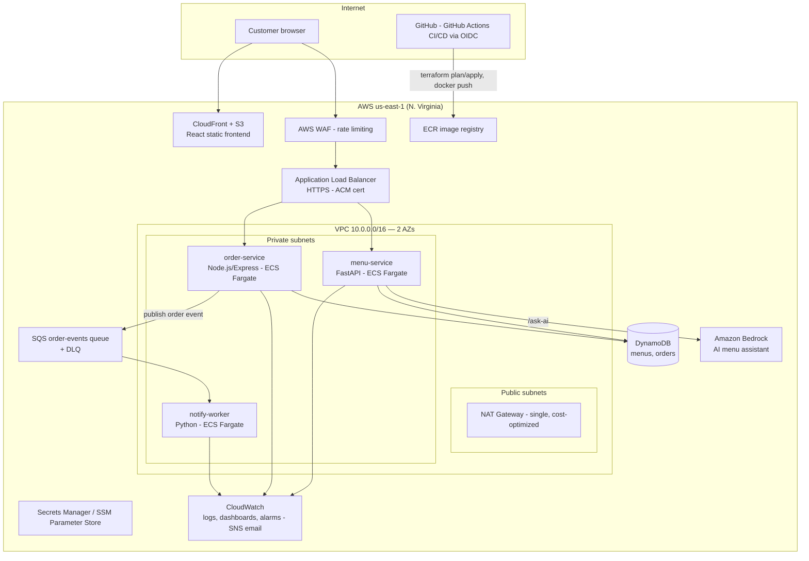

# 🍜 MakanLah — Cloud-Native Food-Ordering Platform on AWS

> **MakanLah** is a cloud-native food-ordering platform for Malaysian hawker stalls, built and
> operated like a production system: microservices on AWS ECS Fargate (with an EKS/Kubernetes
> deployment track), 100% Terraform-managed infrastructure, GitHub Actions CI/CD with OIDC
> (zero stored cloud credentials), full observability, DevSecOps scanning gates, and an Amazon
> Bedrock-powered AI menu assistant. Designed for high availability, least-privilege security,
> and a <$15/month steady-state AWS bill.

**Status: 🚧 Phase 0 — Foundations** (remote state, CI identity via OIDC, cost guardrails)

## Target architecture



## Build phases

| Phase | Scope | Status |
|---|---|---|
| 0 | Foundations: remote state, GitHub OIDC CI roles, budget guardrails | 🚧 in progress |
| 1 | Services: menu-service (FastAPI), order-service (Node), notify-worker (Python) | ⬜ |
| 2 | Core infra: VPC, ALB, ECS Fargate, DynamoDB, SQS — all Terraform | ⬜ |
| 3 | CI/CD: plan-on-PR, security gates, auto-apply dev, gated prod, auto-rollback | ⬜ |
| 4 | Observability: dashboards, alarms, X-Ray tracing, k6 load tests, chaos drill | ⬜ |
| 5 | Kubernetes track: kind → ephemeral EKS + Helm + HPA + Prometheus/Grafana | ⬜ |
| 6 | GenAI: Amazon Bedrock menu assistant grounded in DynamoDB data | ⬜ |
| 7 | Packaging: docs, demo video, architecture walkthrough | ⬜ |

## Security posture (from day 1)

- **Zero stored cloud credentials** — GitHub Actions authenticates to AWS via OIDC federation;
  the read-only plan role is assumable from any ref of this repo, the deploy role only from
  `main`, release tags, and gated environments
- Terraform state in a **versioned, encrypted S3 bucket** with a TLS-only bucket policy and all
  public access blocked
- **AWS Budget guardrail created before the first `terraform apply`**: $5/month with email
  alerts at 50/80/100% actual and 100% forecasted spend — environments are torn down between
  work sessions to stay under it
- Deploy role cannot touch IAM outside project-prefixed resources, and is explicitly denied
  from modifying the CI roles themselves

## Repository layout

```
├── docs/decisions/     # Architecture Decision Records
├── infra/bootstrap/    # applied once: state bucket, OIDC provider, CI roles
├── infra/modules/      # reusable Terraform modules (Phase 2+)
├── infra/envs/         # dev / prod environments (Phase 2+)
├── services/           # menu-service, order-service, notify-worker (Phase 1+)
├── frontend/           # React + Vite (Phase 2+)
└── .github/workflows/  # CI/CD pipelines
```

## Project spec

The full build spec, market research, and phase acceptance criteria live in
[AWS_CAREER_PROJECT_HANDOFF.md](AWS_CAREER_PROJECT_HANDOFF.md).
