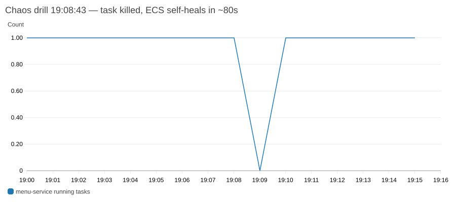
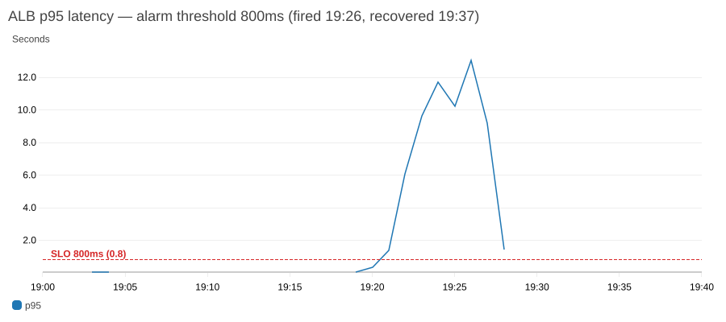
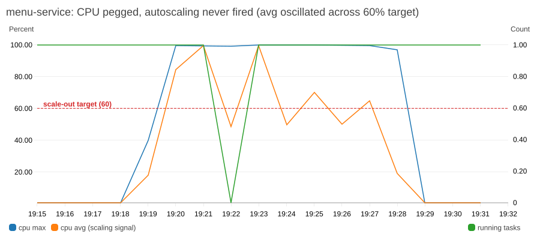
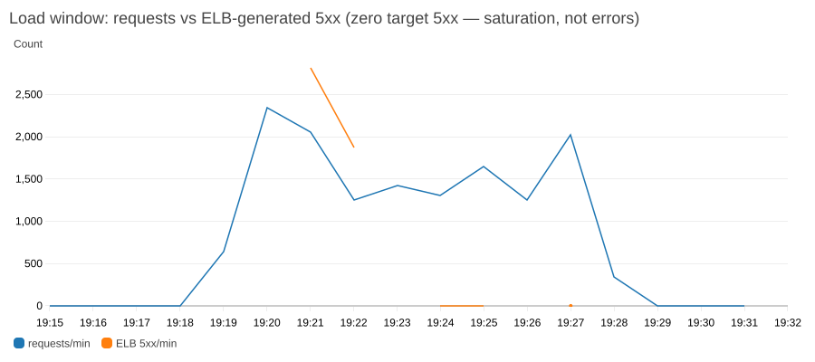

# Phase 4 evidence — load test, chaos drill, and what the telemetry caught (2026-07-12)

k6 profile: `load/k6/order-flow.js` — ramp to 200 VUs over 9 minutes, 80% browse /
20% order mix. Raw results in `load/k6/results/`.

## Drill 1 (accidental): the WAF ate the load test

First run: **98.72% of 95,087 requests blocked** with fast 403s (~175 req/s from one
IP). The WAF per-IP rate limit (500 requests / 5 min) classified the load generator as
a DoS source and shut it off — which is exactly its job. Security control validated at
no extra charge. For the real test the limit was raised temporarily via the AWS CLI
(the env is destroyed after the session; the Terraform default stays 500).

**Lesson:** load-test from multiple sources, or stage a WAF exception for the test IP.

## Drill 2: chaos — task killed at peak load

`aws ecs stop-task` on menu-service's only task at 19:08:43 UTC, mid-load:

```
19:08:43  task killed (chaos drill: task kill under load)
19:09:02  runningCount=0        ← outage window starts
19:09:26  ECS starts replacement task
19:09:55  registered with target group
19:10:04  service steady state  ← ~80s total, zero human intervention
```



**Honest finding:** with dev's `desired_count=1`, killing the only task means ~80
seconds of 503s for that service. Self-healing works; capacity math is the fix —
prod's `desired_count=2` exists precisely for this. The `*-no-running-tasks` alarm
(2-min evaluation) did not page for an 80s gap — acceptable by design for dev.

## Drill 3: saturation — 200 VUs vs one 0.25-vCPU task

Second run (19:19–19:28 UTC), WAF out of the way:

| Metric | Value |
|---|---|
| Requests completed | 17,961 (33/s — the backend was the throttle) |
| p95 latency | **10.29s** (SLO: 800ms) |
| Failures | 26.13% — **all 4,694 were ELB-generated** (3,674 × 503), zero target 5xx |
| menu-service CPU (max) | pegged 99–100% for 8 minutes |
| Tasks | **1 the whole time — autoscaling never fired** |



**The alerting worked:** `makanlah-dev-p95-latency` went ALARM at 19:26:03 (SNS email
sent) and auto-recovered at 19:37:03.

**The autoscaling didn't — and the chart shows why:**



Target tracking scales out on *3 consecutive minutes of average CPU above target
(60%)*. The per-minute averages sawtoothed across the line (18 → 84 → 99 → 49 → 99 →
50 → 70 → 50 → 65) while max CPU sat at 100% — the single-worker service was fully
saturated but the smoothed signal kept dipping below threshold, resetting the breach
counter every other minute. Meanwhile every failure was an ELB 503 (connection
overflow to the saturated target), which the target-5xx deploy gate doesn't watch:



## Follow-ups (filed as issues)

1. **Scale on `ALBRequestCountPerTarget`** (or add it alongside CPU): request pressure
   is the real signal for a request-bound service, and it doesn't sawtooth.
2. **Add `HTTPCode_ELB_5XX_Count` to the alarm set and deploy gate**: target-5xx
   catches app bugs; ELB-5xx catches saturation and no-healthy-target states.

The interview version: *the load test succeeded by failing* — it proved the WAF, the
paging path, and the self-healing, and it caught two monitoring/scaling design gaps
that only show up under real pressure.
